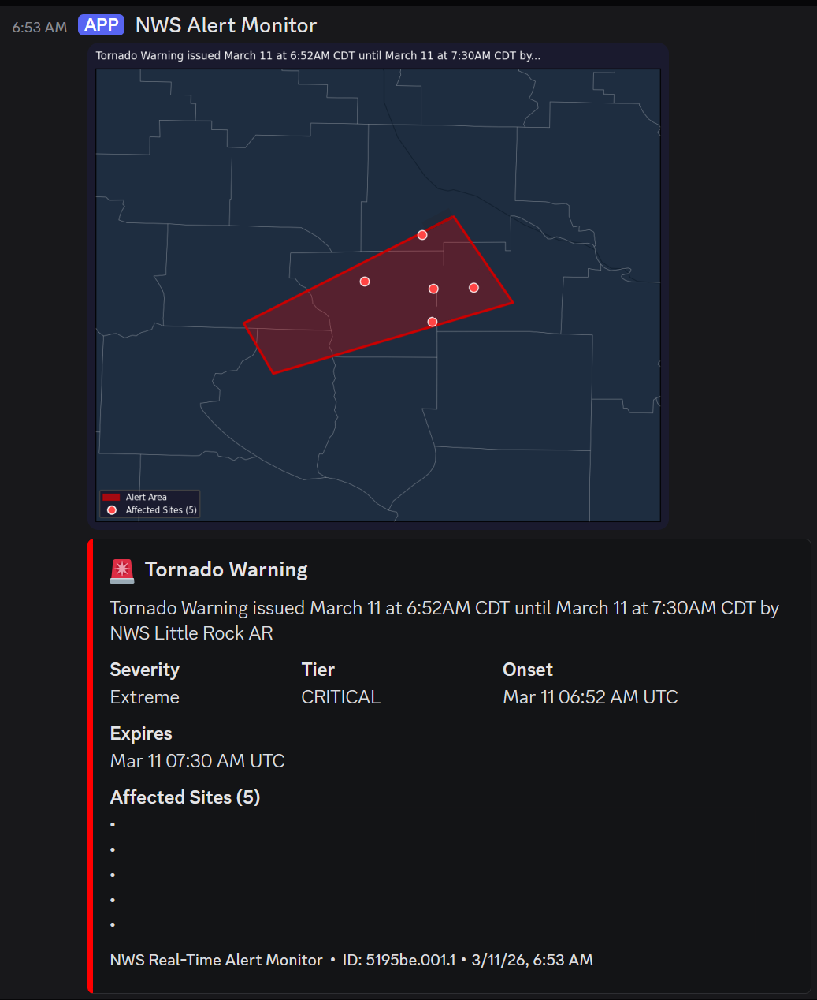
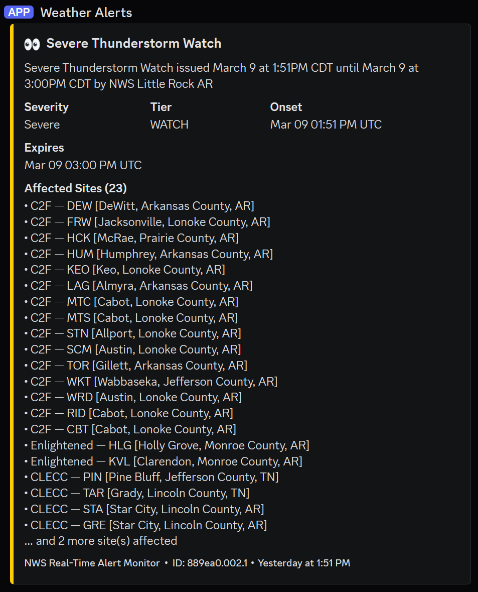

# NWS Real-Time Weather Alert Monitor

A Python-based real-time weather alert monitoring system that polls the National Weather Service (NWS) alerts API and sends tiered notifications to Discord and Slack webhooks when alerts affect your monitored locations.

Designed for Network Operations Centers (NOCs) managing geographically distributed infrastructure that needs immediate awareness of severe weather impacting critical sites.

## Features

- **Near real-time monitoring** — Uses HTTP `Last-Modified` header checking for ~30 second alert latency vs standard polling
- **Intelligent site matching** — Polygon intersection (preferred) + UGC zone/county code fallback
- **Multi-platform notifications** — Discord rich embeds + Slack Block Kit attachments
- **Tiered alert system** — Critical / Warning / Watch / Advisory with color-coded embeds
- **Auto-generated maps** — Optional PNG map generation showing alert polygons, county boundaries, and affected site pins
- **Startup awareness** — On launch, reports all currently active alerts affecting your sites
- **Graceful shutdown** — SIGINT/SIGTERM handlers with shutdown notifications
- **Minimal API load** — Lightweight HEAD requests every 30s, full fetch only when feed changes

---

## Example Notifications

### Tornado Warning

*Tornado Warning with auto-generated map showing alert polygon and affected sites*

### Severe Thunderstorm Watch

*Severe Thunderstorm Watch notification* 

### Other Alert Types
Additional examples showing startup, shutdown, and summary notifications are available in [docs/screenshots/](docs/screenshots/).

---

## Alert Types Monitored

### Critical (Red 🚨)
- Tornado Emergency
- Tornado Warning
- Flash Flood Emergency

### Warning (Orange ⚠️)
- Severe Thunderstorm Warning
- Flash Flood Warning
- Blizzard Warning
- Ice Storm Warning
- Extreme Wind Warning
- Winter Storm Warning

### Watch (Yellow 👀)
- Tornado Watch
- Severe Thunderstorm Watch
- Winter Storm Watch
- High Wind Warning

### Advisory (Blue 🔵)
- Wind Advisory
- Significant Weather Advisory
- Special Weather Statement
- Extreme Cold Warning
- Dust Storm Warning

## Requirements

- Python 3.12+
- Internet connectivity for NWS API access
- Discord and/or Slack webhook URLs

### Python Dependencies

```
requests
shapely
matplotlib
cartopy
numpy
```

Install with:
```bash
pip install -r requirements.txt
```

**Note:** `cartopy` requires system-level geospatial libraries. See [Installation](#installation) for platform-specific instructions.

## Installation

### Windows

1. **Install Python 3.12+** from [python.org](https://www.python.org/downloads/)

2. **Install geospatial dependencies for cartopy:**
   - Download and install [OSGeo4W](https://trac.osgeo.org/osgeo4w/) or use conda:
     ```bash
     conda install -c conda-forge cartopy
     ```
   - Alternatively, use pre-built wheels from [Christoph Gohlke's repository](https://www.lfd.uci.edu/~gohlke/pythonlibs/)

3. **Clone this repository:**
   ```bash
   git clone https://github.com/ODST-Aaron/nws-realtime-alerts.git
   cd nws-realtime-alerts
   ```

4. **Install Python dependencies:**
   ```bash
   pip install -r requirements.txt
   ```

### Linux (Ubuntu/Debian)

```bash
# Install system dependencies
sudo apt-get update
sudo apt-get install python3-pip libgeos-dev libproj-dev proj-data proj-bin

# Clone repository
git clone https://github.com/ODST-Aaron/nws-realtime-alerts.git
cd nws-realtime-alerts

# Install Python dependencies
pip install -r requirements.txt
```

### Oracle Cloud / Production Deployment

For headless server deployment (Oracle Cloud, AWS, etc.):

```bash
# Install system dependencies
sudo yum install -y python3-pip geos-devel proj-devel

# Clone repository
git clone https://github.com/ODST-Aaron/nws-realtime-alerts.git
cd nws-realtime-alerts

# Install Python dependencies
pip3 install -r requirements.txt

# Run as a systemd service (optional)
sudo cp nws-alerts.service /etc/systemd/system/
sudo systemctl daemon-reload
sudo systemctl enable nws-alerts.service
sudo systemctl start nws-alerts.service
```

## Configuration

### 1. Create your locations CSV

The monitor requires a CSV file with your monitored sites. Use `locations_example.csv` as a template.

**Required columns:**
- `Customer` — Client/customer name
- `Name` — Site identifier
- `SiteType` — Site type (e.g., Tower, POP, Datacenter)
- `Latitude` — Decimal degrees (e.g., 35.8423)
- `Longitude` — Decimal degrees (e.g., -90.7043)
- `City` — City name
- `County` — County name (without "County" suffix)
- `CountyCode` — NWS county UGC code (e.g., ARC055)
- `State` — Two-letter state abbreviation
- `Zone` — NWS forecast zone code (e.g., ARZ026)

**To auto-populate Zone, CountyCode, County, and City columns:**

```bash
# Edit INPUT_CSV and OUTPUT_CSV paths in bulk_zone_lookup.py
py -3.12 bulk_zone_lookup.py
```

This script queries the NWS `/points/` API for each site and populates the geographic fields automatically. Runtime: ~1 second per site.

### 2. Configure webhook URLs

Edit `weather_alerts.py` and set your webhook URLs:

```python
DISCORD_WEBHOOK = "https://discord.com/api/webhooks/YOUR_WEBHOOK_HERE"
SLACK_WEBHOOK   = "https://hooks.slack.com/services/YOUR_WEBHOOK_HERE"  # or None
```

To create webhooks:
- **Discord:** Server Settings → Integrations → Webhooks → New Webhook
- **Slack:** Workspace Settings → Manage Apps → Incoming Webhooks → Add to Slack

### 3. Adjust file paths (if needed)

If not running from `C:\nws-realtime-alerts\`, update these paths in `weather_alerts.py`:

```python
CSV_FILE    = r"C:\nws-realtime-alerts\locations.csv"
CACHE_FILE  = r"C:\nws-realtime-alerts\seen_alerts.json"
ACTIVE_FILE = r"C:\nws-realtime-alerts\active_alerts.json"
```

### 4. Configure map generation (optional)

To disable map generation:

```python
ENABLE_MAPS = False
```

Maps are generated as PNG attachments and sent with Discord embeds. Slack support for map delivery is pending (currently shows "Map attached" footer note).

## Usage

### Run the monitor

```bash
py -3.12 weather_alerts.py
```

The monitor will:
1. Send a startup notification to Discord/Slack
2. Check for any alerts already active at startup
3. Begin polling the NWS API every 30 seconds
4. Post alert embeds when new alerts affect your sites
5. Send periodic summaries of active alerts (configurable)

### Graceful shutdown

Press `Ctrl+C` to trigger graceful shutdown. The monitor will:
- Send a shutdown notification
- Save the seen alerts cache
- Exit cleanly

### Run as a background service (Windows)

Use NSSM (Non-Sucking Service Manager):

```bash
# Download NSSM from https://nssm.cc/download
nssm install NWSAlerts "C:\Python312\python.exe" "C:\nws-realtime-alerts\weather_alerts.py"
nssm start NWSAlerts
```

### Run as a systemd service (Linux)

Example `nws-alerts.service`:

```ini
[Unit]
Description=NWS Real-Time Alert Monitor
After=network.target

[Service]
Type=simple
User=your-username
WorkingDirectory=/path/to/nws-realtime-alerts
ExecStart=/usr/bin/python3 /path/to/nws-realtime-alerts/weather_alerts.py
Restart=on-failure
RestartSec=30

[Install]
WantedBy=multi-user.target
```

## File Structure

```
nws-realtime-alerts/
├── weather_alerts.py          # Main monitoring script
├── notifier.py                # Discord/Slack notification abstraction
├── alert_mapper.py            # PNG map generation module
├── bulk_zone_lookup.py        # NWS zone/county lookup utility
├── locations.csv              # Your monitored sites (not in repo)
├── locations_example.csv      # Template for locations.csv
├── seen_alerts.json           # Alert cache (auto-generated)
├── active_alerts.json         # Active alerts tracking (auto-generated)
├── requirements.txt           # Python dependencies
├── README.md                  # This file
└── .gitignore                 # Git ignore rules
```

## How It Works

### Efficient Polling Architecture

Instead of fetching the entire NWS alerts feed every poll interval (which would be ~500KB every 30s), the monitor uses HTTP `Last-Modified` header checking:

1. **HEAD request** every 30 seconds (~1KB, no body)
2. **Compare** `Last-Modified` header to cached value
3. **Full GET fetch** only when header changes
4. **Process** alerts and match against monitored sites

This reduces bandwidth by ~98% vs naive polling.

### Site Matching Logic

The monitor uses two methods to determine if a site is affected by an alert:

#### 1. Polygon Matching (Preferred)
Most NWS warnings include GeoJSON polygon geometry. The monitor checks if each site's coordinates fall inside the alert polygon using Shapely.

#### 2. UGC Zone/County Fallback
When polygon geometry is absent (common for SPC watches), the monitor falls back to matching the site's `Zone` or `CountyCode` against the alert's UGC codes.

**Example:** An SPC Tornado Watch lists `["ARC055", "ARC031", "ARZ026"]` in `properties.geocode.UGC`. Sites with matching zone or county codes are flagged as affected.

### Startup Behavior

On launch, the monitor:
1. Fetches the current NWS feed
2. Identifies all active alerts affecting your sites
3. Posts **full alert embeds** for new alerts not in the cache
4. Posts a **summary embed** for alerts already in the cache (prevents duplicate notifications while maintaining situational awareness)

This ensures your team has complete context on startup without spam from alerts you were already notified about.

## Map Generation

The `alert_mapper.py` module generates static PNG maps showing:

- **Alert polygon** (for warnings with GeoJSON geometry)
- **County boundaries** (for UGC fallback alerts like SPC watches)
- **Affected site pins** with labels (red)
- **State and county boundary lines** for geographic context
- **Dark theme** optimized for NOC displays

Maps are attached to Discord embeds. Slack support is pending (currently shows "Map attached" footer note).

### Map Rendering

Maps use:
- **matplotlib** for rendering
- **cartopy** for geographic projections and base maps
- **shapely** for geometry operations
- **Census Bureau TIGER** county shapefiles (fetched at runtime, cached in memory)

The mapper automatically computes map extent from alert geometry and affected sites, ensuring all relevant features are visible.

## Configuration Options

### Poll Intervals

```python
HEAD_INTERVAL    = 30    # seconds between lightweight HEAD checks
SUMMARY_INTERVAL = 600   # seconds between active alert summaries (0 to disable)
```

### Monitored Alert Types

Edit `SEVERITY_TIERS` in `weather_alerts.py` to add/remove alert types:

```python
SEVERITY_TIERS = {
    "critical": [
        "Tornado Emergency",
        "Tornado Warning",
        # Add more...
    ],
    # ...
}
```

### Map Appearance

Edit `alert_mapper.py` to customize:
- Colors (`COLOR_POLYGON`, `COLOR_AFFECTED_PIN`)
- Map size (`MAP_FIGSIZE`, `MAP_DPI`)
- Padding around alert extent (`PADDING_DEG`)

## Troubleshooting

### "No locations loaded — check your CSV path and format"

- Verify `CSV_FILE` path is correct
- Check CSV has required columns (at minimum: `Latitude`, `Longitude`)
- Ensure CSV uses comma delimiters (tab-delimited also supported via auto-detection)

### "✗ HEAD request failed" or "✗ GET request failed"

- Check internet connectivity
- Verify firewall allows HTTPS to `api.weather.gov`
- NWS API may be temporarily down (retry after 1-2 minutes)

### Maps not generating

- Verify `cartopy` is installed correctly: `python -c "import cartopy; print(cartopy.__version__)"`
- Check system geospatial libraries are installed (GEOS, PROJ)
- Set `ENABLE_MAPS = False` to disable map generation and continue monitoring

### "✗ Discord error" or "✗ Slack error"

- Verify webhook URLs are correct
- Check webhook hasn't been deleted from Discord/Slack
- Test webhook manually with `curl`:
  ```bash
  curl -X POST -H "Content-Type: application/json" \
    -d '{"content":"Test message"}' \
    YOUR_DISCORD_WEBHOOK_URL
  ```

### Alert not matching sites despite being in the area

- Check site's `Zone` and `CountyCode` are populated (run `bulk_zone_lookup.py` if needed)
- Verify coordinates are in decimal degrees (not DMS format)
- Enable debug logging to see which matching method is being used

## Companion Projects

- **[SPC Mesoscale Discussion Monitor](https://github.com/ODST-Aaron/spc-md-monitor)** — Monitors SPC MD RSS feed for pre-watch outlooks
- **[NWS Alert Mapper](https://github.com/ODST-Aaron/nws-alert-mapper)** — Standalone alert map generator (pending creation)

## Contributing

Pull requests welcome. For major changes, please open an issue first to discuss what you'd like to change.

## License

MIT License — see LICENSE file for details

## Acknowledgments

- **National Weather Service** — Alert data and API
- **Storm Prediction Center** — Mesoscale Discussion feed
- **Census Bureau TIGER** — County boundary shapefiles
- **Shapely, Cartopy, Matplotlib** — Geospatial and mapping libraries

## Author

**Aaron @ Irby Utilities NOC**  
Jonesboro, Arkansas

---

**Disclaimer:** This software is provided as-is for informational purposes. Always follow official NWS alerts and warnings. The developer assumes no liability for decisions made based on alerts delivered by this system.
